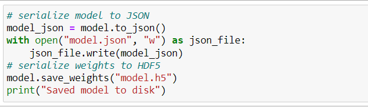

# BitcoinPredictionApp

### Saving the Neural Network Model to JSON
We have trained our LSTM model on the extended 6 year Bitcoin Price dataset. The model is then converted to JSON format and written to model.json in the local directory. The network weights are written to model.h5 in the directory.

The model and weight data is loaded from the saved files and a new model is created in BitcoinPredictionApp.py.

### Directory Structure

* templates: This folder contains the html files (home.html, predict.html) that would be used by our main file (BitcoinPredictionApp.py) to generate the front end of our application

* BitcoinPredictionApp.py: This is the main application file, where all our code resides and it binds everything together.

* requirements.txt: This file contains all the dependencies/libraries that would be used in the project

* model.json: This is our LSTM model, which we have trained already.

* model.h5: The network weights are written to this file

* Procfile : This is a special file that would be required when we would be deploying the application in Heroku.

* dfe.pkl: This file contains the 6 year dataset on which the model is trained

## Understanding code

### BitcoinPredictionApp.py file

The first line @app.route (‘/’) is a decorator, it maps the method defined below it to the URL mentioned inside the decorator, i.e. whenever user visits that URL ‘/’, home() method would be called automatically, and the home() method returns our main HTML page called home.html 
The flask.render_template() looks for the this home.html file in the templates folder that we created in our directory and dynamically renders a HTML page for the end user.

Now we have another decorator @app.route (‘/predict’), this one maps the predict() method with the /predict URL , this predict() method as the name suggests takes the input given by the user, does all the preprocessing, generates the Price data of previous 15 days, runs the model on it and gets the final prediction for n number of days as provided in the input. 
Inside the predict() method we have requested two inputs given by the user, date (first day from which date the prediction needs to be done) and n (number of days for which the prediction needs to be done)
prev_data contains the Price data of 15 previous days and then scaled it using the MinMaxScaler as done before training the model.
Now, a loop is created which is going to predict the Price value for next n days in lst_output, inverse transform is then applied to get the unscaled values in res.

This time the flask.render_template() looks for the result.html file in the templates folder, we have passed res, len(res) and n to the result.html file.

Finally app.run() is called under if \_\_name\_\_ == "\_\_main\_\_":

### home.html and predict.html file

In home.html where the form is created, we can see a field called action this means, that the form data is sent to the page specified in the action attribute and the method attribute tells us how this form data is shared, here we have used POST method which simply means that this form data is shared as a json.

Inside the form we have asked the user for two inputs, date (first day from which date the prediction needs to be done) and n (number of days for which the prediction needs to be done).
We have created a Predict button and a Reset button.

predict.html template basically takes the prediction output and displays the result according to the output values.

* {{}} is used to add variables/placeholders (passed already by the render_template inside predict() method)

* { % %} to write statements like if-else conditions, for loops, etc.

A loop has been run in this file to display the output for next n days. 
